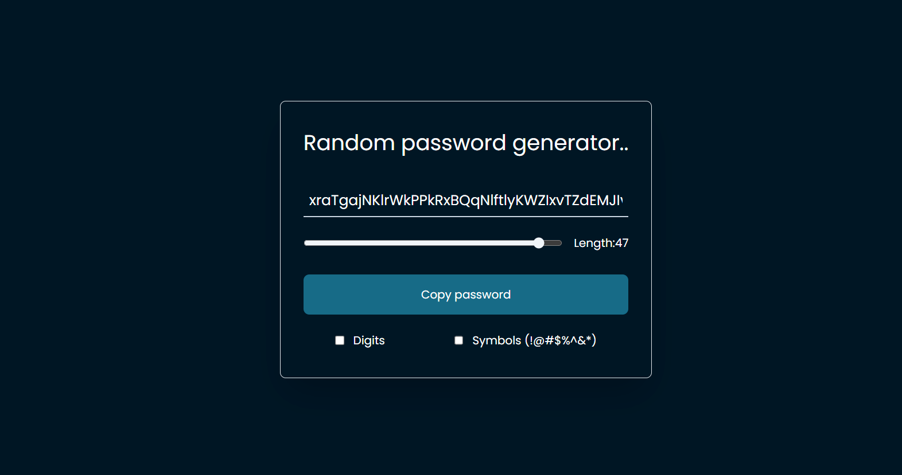

# Random Password Generator



This is a simple and sleek web-based random password generator built using React. It allows you to generate secure passwords with various options such as length, numbers, and special characters.

## Features

- **Password Length Slider**: Adjust the length of the password with a user-friendly slider. Choose any length between 8 and 50 characters.

- **Include Numbers**: Enable this option to include numbers (0-9) in your generated password.

- **Include Special Characters**: You can also include special characters like `!@#$%^&*` for added complexity and security.

- **Copy to Clipboard**: Once you have generated a password that suits your needs, simply click the "Copy Password" button to copy it to your clipboard for easy pasting.

- **Feedback on Copy**: The button label changes to "Copied!!" when the password is successfully copied to the clipboard, providing visual feedback.

## How to Use

1. Visit the [Random Password Generator](https://password-generator-wine-kappa.vercel.app/) webpage.

2. Use the password length slider to select your desired password length.

3. Toggle the "Digits" and "Symbols (!@#$%^&*)" checkboxes to include numbers and special characters in your password.

4. Once you are satisfied with your password configuration, click the "Copy Password" button.

5. The generated password will be copied to your clipboard, and you can paste it wherever you need a secure password.

## Installation

If you want to run this application locally, follow these steps:

1. Clone this repository to your local machine:

   ```
   git clone https://github.com/hirendhola/password-gen.git
   ```

2. Navigate to the project directory:

   ```
   cd random-password-generator
   ```

3. Install the necessary dependencies:

   ```
   npm install
   ```

4. Start the development server:

   ```
   npm run dev
   ```

5. Open your web browser and go to [http://localhost:5173](http://localhost:5173) to use the password generator.

## Feedback and Contributions

Feel free to provide feedback or report.

If you would like to contribute to the project, please fork the repository, make your changes, and create a pull request. Your contributions are highly appreciated!

---

Enjoy generating strong and secure passwords with ease using the Random Password Generator! If you find this project helpful, please consider giving it a star ⭐️ on GitHub. Thank you for using and contributing to this open-source tool!
